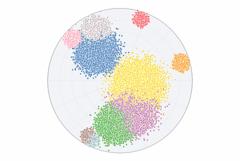

# hyper-scatter

<!-- badges -->
[](https://www.npmjs.com/package/hyper-scatter)
[](https://opensource.org/licenses/MIT)

**Hyperbolic (Poincaré) embeddings at 60 FPS. 20,000,000 points. Pure WebGL2 (no `regl`, no `three.js`).**

<p align="center">
  
  <br>
  <em>Hyperbolic pan & zoom in the Poincaré disk — points follow geodesics</em>
</p>

A specialized scatterplot engine for [HyperView](https://github.com/HackerRoomAI/HyperView).

- Geometries: **Poincaré (hyperbolic)** + **Euclidean** today; **Spherical (S²)** is a good future contribution.
- Correctness: a slow CPU **Reference** defines semantics; the fast GPU **Candidate** must match.
- Implementation: **pure WebGL2** (no `regl`, no `three.js`, no runtime deps).

---

## Poincaré (Hyperbolic) semantics

This is the part most scatterplot libs don’t have.

- **View state:** Möbius isometry parameter $a=(a_x,a_y)$ with $|a|<1$, plus a separate `displayZoom` scalar.
- **Pan:** anchor-invariant (the point under the cursor stays under the cursor).
- **Zoom:** anchored zoom; `displayZoom` scales the visual disk without changing the underlying isometry.
- **Project / unproject:** stable round-trips, shared between Reference + Candidate math.
- **Hit-test:** hyperbolic-aware, disk-culls correctly, deterministic tie-breaking.
- **Lasso:** selection polygon is unprojected to data space; membership is verified against the Reference.

For the full invariants + how the harness selects candidate code paths, see [AGENTS.md](AGENTS.md).

## Usage (copy/paste agent prompt)

```text
You are a coding agent working in my repository.

Use these imports:

   import {
      EuclideanWebGLCandidate,
      HyperbolicWebGLCandidate,
      createDataset,
      createInteractionController,
      type SelectionResult,
   } from 'hyper-scatter';

Goal:
- Integrate `hyper-scatter` to render my embedding scatterplot.

Requirements:
1) Install:
   - npm: `npm install hyper-scatter`

2) Implement a small integration wrapper:
    - Create `mountHyperScatter(canvas, params)` (or an idiomatic React hook).
    - Pick renderer:
       - if params.geometry === 'poincare' use `new HyperbolicWebGLCandidate()`
       - else use `new EuclideanWebGLCandidate()`
    - Ensure the canvas has a real CSS size (non-zero width/height).
    - Init using CSS pixels:
       - `const rect = canvas.getBoundingClientRect()`
       - `renderer.init(canvas, { width: Math.max(1, Math.floor(rect.width)), height: Math.max(1, Math.floor(rect.height)), devicePixelRatio: window.devicePixelRatio })`
    - Dataset:
       - `renderer.setDataset(createDataset(params.geometry, params.positions, params.labels))`
    - First frame:
       - `renderer.render()`

3) Wire interactions:
   - Use `createInteractionController(canvas, renderer, { onHover, onLassoComplete })`.
   - On lasso completion, keep the returned `SelectionResult` and (optionally) call:
     - `await renderer.countSelection(result, { yieldEveryMs: 0 })` if you need an exact count without UI yielding.

4) Cleanup:
   - On unmount/destroy: `controller.destroy(); renderer.destroy();`

Deliverables:
- The concrete code changes + file paths.
- A minimal example showing how to pass `Float32Array positions` (flat [x,y,x,y,...]) and optional `Uint16Array labels`.
```

## Benchmarks

Main claim, measured via the browser harness (headed):

Config note: canvas `1125x400 @ 1x DPR` (Puppeteer).

| Geometry | Points | FPS (avg) |
|---|---:|---:|
| Euclidean | 20,000,000 | 59.9 |
| Poincaré | 20,000,000 | 59.9 |

Run the stress benchmark that reproduces the rows above:

```bash
npm run bench -- --points=20000000
```

Default sweep (smaller point counts): `npm run bench`

Note: for performance numbers, run headed (default). Headless runs can skew GPU timing.

## How we built it

I (Matin) only knew Python. So we built this as a lab with a clear loop.

Roles:

- Matin: architect/product (Python-first).
- Claude: harness/environment engineer (benchmarks + correctness tests + reference semantics).
- Codex: implementation engineer (WebGL2 candidate).

### 1) Reference first

- Write non-performant, readable Canvas2D renderers (`src/impl_reference/`).
- Treat them as semantics: projection, pan/zoom, hit-test, lasso.

### 2) Harness as the reward function

- Accuracy compares Reference vs Candidate for: project/unproject, pan/zoom invariance, hit-test, lasso.
- Performance tracks: FPS, pan/hover FPS, hit-test time, lasso time.

### 3) Candidate optimization

- Implement the WebGL2 candidate (`src/impl_candidate/`).
- Speed comes from GPU rendering + spatial indexing + adaptive quality.

### 4) Reward hacking notes

If you give an agent a benchmark, it will try to win.

- Editing the harness/tolerances instead of fixing precision.
- Making lasso “async” so the timer looks better.

The harness tries to reduce these paths (example: lasso timing is end-to-end and includes the work required to get an exact selected-count).

## Status & Roadmap

- [x] Euclidean Geometry
- [x] Poincaré Disk (Hyperbolic) Geometry
- [ ] **Spherical Geometry (S²)**: The architecture supports it (`GeometryMode` enum), but the Reference math is missing. Contributions welcome.

## License

MIT © [Matin Mahmood](https://www.linkedin.com/in/matin-mahmood/) (X: [@MatinMnM](https://twitter.com/MatinMnM))
